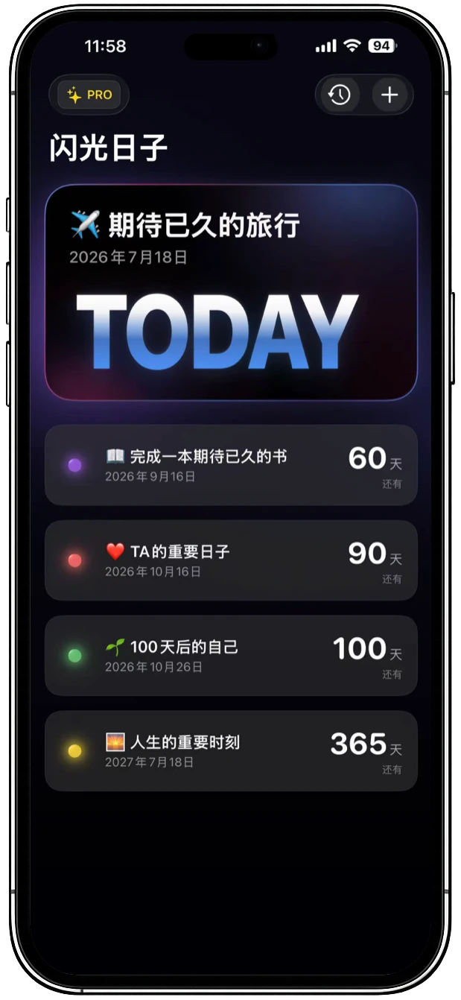
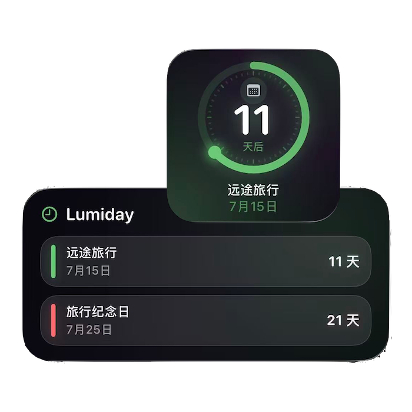
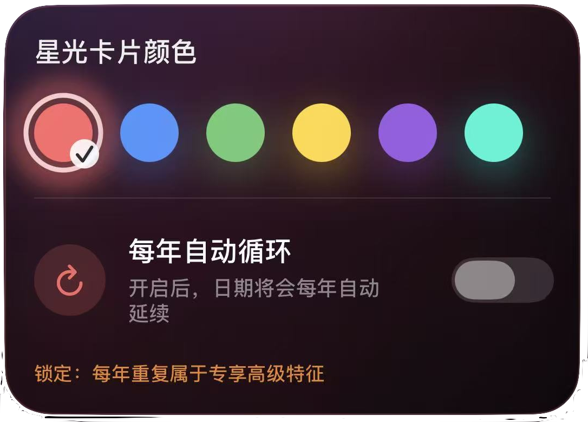

# Lumiday

### 闪光日子

**Give every day something to look forward to.**  
**让每一天，都有值得期待的理由。**

A beautifully designed countdown app for life's important moments.  
一款为人生重要时刻而设计的高品质倒计时应用。

Lumiday helps you keep meaningful days close: anniversaries, birthdays, travel plans, exams, personal milestones, and the quiet moments that matter only to you.

它记录那些值得等待、值得庆祝、值得被认真放在心上的日子。不是为了计算时间本身，而是为了让时间重新有情绪、有温度、有期待。

---

## Screenshots

<table>
  <tr>
    <td align="center">
      
       
      Home
    </td>
    <td align="center">
      
       
      Today Highlight
    </td>
  </tr>
  <tr>
    <td align="center">
      
       
      Widgets
    </td>
    <td align="center">
      
       
      Aurora Themes
    </td>
  </tr>
</table>

---

## Features

- Beautiful countdown experience
- Today Highlight
- iOS Widgets
- Aurora-inspired themes
- Local First
- No Account
- No Cloud Required
- Privacy by Design

---

## About Lumiday

Lumiday is a calm and minimal countdown app for meaningful life moments.

It is designed for the days you want to remember before they arrive, the days you want to notice when they are here, and the days that make ordinary life feel quietly brighter.

Lumiday 让重要日子变得清晰、安静而靠近。

当某一天正在到来，你可以提前感受它；当某一天已经抵达，你可以温柔地看见它；当生活被日常覆盖，它仍会提醒你，还有一些事情值得期待。

---

## Local First

Lumiday is built around a simple privacy belief: your meaningful days belong to you.

✔ Local First  
✔ No Account  
✔ No Cloud Sync  
✔ No Tracking  
✔ Your data stays on your own device.

Lumiday 从一开始就选择一种更安心的方式。

你的记录属于你，也只属于你的设备。重要的日子不应该成为服务器上的数据点。它们应当安静地留在你手里，留在你的设备中。

---

## Designed for Meaningful Moments

### Today Highlight

Some days are not far away. They are happening now.

Lumiday helps you notice whether today carries a special meaning, so the present moment does not pass by unnoticed.

### Countdown to Important Days

Travel, birthdays, anniversaries, exams, personal plans, and small private promises all deserve a clear place.

Lumiday keeps these moments visible with a quiet, focused countdown experience.

### iOS Widgets

The days you care about should be easy to see.

With iOS widgets, meaningful moments can stay on your Home Screen, becoming part of your everyday rhythm.

### Aurora-Inspired Themes

Lumiday's visual themes are inspired by soft light in the dark: purple and blue aurora tones, gentle glow, and a quiet sense of anticipation.

每一个倒计时，都可以拥有自己的光。

---

## Privacy by Design

Privacy is not an extra note in Lumiday. It is part of the product itself.

Lumiday does not collect your countdown content.  
Lumiday does not require an account.  
Lumiday does not track your behavior.  
Lumiday does not show ads.  
Lumiday does not upload your records to a server by default.

All app data is stored locally on your device.

你记录的纪念日、生日、旅行、考试、备注与主题设置，都只属于你自己。Lumiday 只是帮助你看见它们，而不是占有它们。

---

## Design Philosophy

Lumiday uses a dark visual foundation with soft purple and blue aurora glow, Apple-like minimal interface structure, and glass-like cards that feel light, focused, and calm.

The design is intended to feel polished without becoming loud, emotional without becoming decorative, and useful without asking for attention all the time.

它希望看起来足够精致，也足够安静。像一个只在你需要时轻轻亮起的提醒。

---

## Links

Website  
[https://ciakon.com/](https://ciakon.com/)

Privacy Policy  
[https://ciakon.com/privacy.html](https://ciakon.com/privacy.html)

Feedback Email  
[feedback.glowdays@outlook.com](mailto:feedback.glowdays@outlook.com)

App Store  
Coming Soon

---

## Closing

May every important day be remembered with care.  
愿每一个重要的日子，都能被温柔记录。

**Give every day something to look forward to.**  
**让每一天，都有值得期待的理由。**
